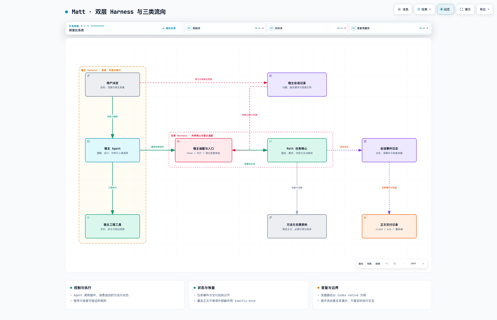

<div align="center">

# Matt Pocock · Engineering Workflows

**Give your Agent's next step a state and a reason.**

Bring engineering methods, task state, and key decisions into Codex, Claude Code, and Devin CLI, with separate releases and acceptance for each host.

[简体中文](README.md) · **English**

[Website](https://ww880412.github.io/matt-pocock-guide/) · [Architecture](https://ww880412.github.io/matt-pocock-guide/architecture.html) · [User guide](https://ww880412.github.io/matt-pocock-guide/guide.html) · [Download for Codex](https://ww880412.github.io/matt-pocock-guide/downloads/matt-pocock-codex.zip)

</div>

---

## Turn a request into a traceable engineering process

Long tasks need more than conversation history. They need a current route, unresolved requirements, human decisions, and a record of state changes. Matt organizes these into a task **Harness**: the model makes professional judgments, code checks verifiable rules, and people retain control over goals and authorization.

```text
Discuss → Specify → Break down tasks → Implement & verify → Review
           Task state, requirements, and decisions persist throughout
```

| What you need | What Matt provides |
| --- | --- |
| Take an idea through implementation | Five engineering routes connecting discussion, specifications, tasks, implementation, and review |
| Perform one focused action | 38 released Codex capabilities, with direct invocation and task-based recommendations |
| Resume a long task | Session events, source verification, and recovery rules that distinguish active and terminal states |
| Get a human decision when needed | Native question association and answer provenance checks; no model-supplied answers |
| Preserve the method's context | Declared procedures and supporting resources, loaded and checked against fixed versions |

## Explore the architecture in motion

[](https://ww880412.github.io/matt-pocock-guide/harness-map.html)

**[Open the interactive Archify diagram →](https://ww880412.github.io/matt-pocock-guide/harness-map.html)**

Explore **control flow / state flow / answer provenance** through guided chapters, node focus, zoom, light and dark themes, and image exports. This README uses a static preview; the interactive viewer runs on GitHub Pages. Animation illustrates authored relationships, not live execution telemetry. The website, guide, and diagram are currently in Chinese; this README is available in both languages.

The [architecture page](https://ww880412.github.io/matt-pocock-guide/architecture.html) explains three concrete design problems: recovering stale state, isolating late answers, and redelivering a procedure after its state change has already been recorded.

## Host support and availability

| Host | Current status | Availability and limits |
| --- | --- | --- |
| Codex | Released native.22 with 38 capabilities | Public ZIP below; includes implement-spec, retro, and v1.3.1 navigation |
| Devin CLI | Local candidate verified for core TTY flows and both follow-up fixes | Not publicly released; interactive questions require TTY |
| Claude Code | Adapter and standalone package implemented | Full host acceptance for the current candidate is pending; no public download |

The tested Devin ACP/print modes have no answer channel. Recovery from interruption at precise commit boundaries still needs verification. The older local candidate has 38 capabilities but does not include v1.3.1 navigation. See [host support](https://ww880412.github.io/matt-pocock-guide/guide.html#hosts) (Chinese).

## Get started

1. [Download the Codex team bundle](https://ww880412.github.io/matt-pocock-guide/downloads/matt-pocock-codex.zip) and follow its README for installation and hook authorization.
2. Once installed, send `$matt-pocock` in a Codex conversation to open the entry menu, or `$matt-pocock help` for the guide.
3. Describe your goal and ask Matt to recommend a method:

```text
$matt-pocock I want to add an export feature. Help me clarify the requirements and scope first.
```

You do not need to memorize the commands. Routine progress follows the agreed goal and authorization; key scope decisions and trade-offs remain yours. See the [user guide](https://ww880412.github.io/matt-pocock-guide/guide.html) for the full workflow.

## Delivery status

| Area | Status as of October 5, 2026 |
| --- | --- |
| Public download | Codex `0.1.0-native.22+codex.20261005101334`, with 38 capabilities |
| Added in this release | implement-spec, retro, and ask-matt v1.3.1 navigation; all 36 existing capabilities remain |
| Claude Code / Devin CLI | Separate packages remain local candidates with no public downloads; remaining host acceptance is tracked independently |
| Codex native questions | Limited human observation for synchronous input; asynchronous cards still have host limitations after a turn ends |
| General-purpose SDK | Task State SDK 0.5.0 input error classification fix embedded; RAC remains on its component-accepted 0.4.1 snapshot |

After ticketing, native.22 offers per-ticket `implement` or whole-spec `implement-spec`, followed by `code-review` and optional `retro`. Whole-spec execution uses existing host agents and worktrees, dependency-aware dispatch, and serial integration. Retrospectives read session evidence and propose improvements without changing checks or configuration. The implement-spec and retro sources are pinned to Matt `d81f3a1`; the ask-matt body uses v1.3.1 navigation from `24fe0ef`. All 36 existing capabilities remain; the other three specialized candidates are not included. See the [new capabilities and scope](https://ww880412.github.io/matt-pocock-guide/guide.html#upstream-candidate).

A bounded synthetic scenario in the real Codex host observed preservation and recovery of work in progress after task failure, resolution of a real Git conflict, and integration in dependency order. Its 11 tests and 33 independent assertions passed. This evidence does not cover every model execution, Claude host acceptance, or new human interactions.

Component checks, real host call chains, and observed human interactions are distinct evidence levels. Publishing the website does not constitute new user acceptance, and improvements in business outcomes have not been verified. See the [release notes and limitations](https://ww880412.github.io/matt-pocock-guide/guide.html#updates).

<details>
<summary>Download verification and maintenance</summary>

For the native.22 ZIP SHA-256, [download the checksum](downloads/matt-pocock-codex.zip.sha256). Verify the download and your actual installation separately. Check the version in a new task after upgrading; existing tasks do not reload the package automatically.

This repository hosts the documentation and download website. Sources are maintained in `docs/site/` of the [plugin project](https://github.com/ww880412/matt-pocock-plugins). Only public pages, diagrams, READMEs, and download files are published here. Plain HTML / CSS / JavaScript, with no backend or build dependencies; GitHub Pages deploys validated artifacts through an explicitly dispatched workflow on `main`.

</details>

## Methods and attribution

Engineering methods come from **Matt Pocock**, and workflow design draws on **Pi Matt**. This project implements the shared task core and host adapters. See the [comparison and adoption scope](https://ww880412.github.io/matt-pocock-guide/#sources) and the [plugin source repository](https://github.com/ww880412/matt-pocock-plugins). The download bundle retains the relevant licenses and attribution.
