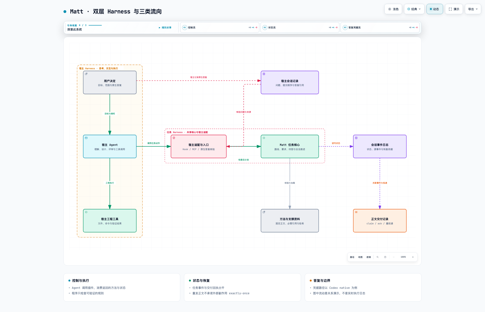

<div align="center">

# Matt Pocock · 工程工作流

**让 Agent 的下一步，有状态，有依据。**

将工程方法、任务状态与关键决定，接入 Claude Code / Codex 的工作过程。

**简体中文** · [English](README.en.md)

[产品主页](https://ww880412.github.io/matt-pocock-guide/) · [架构设计](https://ww880412.github.io/matt-pocock-guide/architecture.html) · [使用指南](https://ww880412.github.io/matt-pocock-guide/guide.html) · [下载 Codex 插件](https://ww880412.github.io/matt-pocock-guide/downloads/matt-pocock-codex.zip)

</div>

---

## 从一句需求，到可追踪的工程过程

长任务需要保留的不只是聊天上下文，还有当前路线、尚未解决的要求、人的关键选择，以及已经发生过的状态变化。Matt 把这些信息组织为任务自己的 **Harness**：模型负责专业判断，程序检查可验证的规则，人保留目标与授权。

```text
讨论需求 → 写出规格 → 拆解任务 → 实现与验证 → 评审
              任务状态、要求与关键答复贯穿过程
```

| 你需要做的事 | Matt 提供的支撑 |
| --- | --- |
| 把想法推进到实现 | 五条工程路线，连接讨论、规格、任务、实现与评审 |
| 只完成一个明确动作 | 35 项独立能力，可单独调用，也可查看推荐 |
| 中断后继续长任务 | 会话事件、来源核对与恢复规则，区分进行中和终态 |
| 在关键位置让人决定 | 原生问题关联与答复来源核验，不接受模型代填答案 |
| 保留方法的完整上下文 | 按声明加载方法正文与支撑资料，校验固定资源 |

## 看懂架构，也看见流向

[](https://ww880412.github.io/matt-pocock-guide/harness-map.html)

**[打开 Archify 动态架构图 →](https://ww880412.github.io/matt-pocock-guide/harness-map.html)**

选择 **控制流 / 状态流 / 答复凭据流**，逐步播放章节；支持节点聚焦、缩放、浅深主题与图像导出。README 展示静态预览，完整交互在 GitHub Pages 中运行。动画说明图中关系，不是实时执行日志。

[架构设计页](https://ww880412.github.io/matt-pocock-guide/architecture.html)进一步解释三个真实设计问题：旧状态如何恢复、迟到答案如何隔离、状态已写入但正文未送达时如何补送。

## 开始使用

1. [下载 Codex 团队分发包](https://ww880412.github.io/matt-pocock-guide/downloads/matt-pocock-codex.zip)，按包内 README 完成安装与 hooks 授权。
2. 安装完成后，在 Codex 对话中发送 `$matt-pocock` 打开入口，或发送 `$matt-pocock help` 查看指南。
3. 描述你的目标，让 Matt 推荐合适的方法，例如：

```text
$matt-pocock 我想给项目增加一个导出功能，先帮我把需求和边界讨论清楚。
```

无需背完命令。日常推进沿用已经明确的目标与授权，关键范围和取舍由你决定。完整操作见[使用指南](https://ww880412.github.io/matt-pocock-guide/guide.html)。

## 当前交付范围

| 项目 | 状态（2026-09-13） |
| --- | --- |
| 公开下载 | Codex `0.1.0-native.16+codex.20260920013154`，已发布 |
| Claude Code | 适配和打包已实现，完整用户验收后置 |
| Codex 原生问答 | 同步已有有限真人观察；异步卡片在回合结束后的入口仍受宿主限制 |
| 通用 SDK | 设计探索，尚未作为独立产品交付 |

组件检查、真实宿主调用链与真人交互是不同证据层级。网站发布不代表新增真人验收，业务效果提升尚未验证。详细变化与边界见[版本说明](https://ww880412.github.io/matt-pocock-guide/guide.html#updates)。

<details>
<summary>下载校验与维护方式</summary>

当前 ZIP 的 SHA-256：

```text
86e98dbaba797651564542350fd969449ff683b6359efdb34ceb4567879e9b8f
```

[下载校验文件](downloads/matt-pocock-codex.zip.sha256)。此次网站更新保留既有下载包字节；包内旧网站链接随后续插件版本更新。

这是独立的文档与下载网站仓库。页面源维护在[插件项目](https://github.com/ww880412/matt-pocock-plugins)的 `docs/site/`，本仓库只发布公开页面、架构图、README 与下载文件。HTML / CSS / JavaScript，无服务端或构建依赖；GitHub Pages 从 `main` 根目录部署。

</details>

## 方法与来源

工程方法来自 **Matt Pocock**，流程设计借鉴 **Pi Matt**；本项目实现共享任务核心与宿主适配。来源及采用范围见[三方对比](https://ww880412.github.io/matt-pocock-guide/#comparison)，插件源码见 [matt-pocock-plugins](https://github.com/ww880412/matt-pocock-plugins)。下载包保留相应许可证与来源说明。
